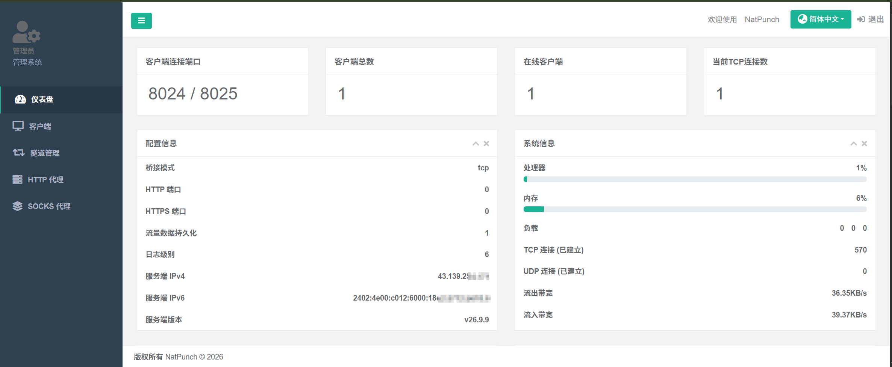

# NatPunch

> 轻量级内网穿透 / 无公网设备管理平台。TLS 全程加密，TCP/UDP 隧道 + HTTP/SOCKS5 代理，静默管理软路由与服务器。

---

## ✨ 特性

- **TLS 全程加密**，数据传输安全可靠
- **TCP / UDP 隧道**：SSH、远程桌面、任意端口，公网直达内网设备
- **HTTP / SOCKS5 代理**：支持账号密码，安全出网
- **静默管理**：实时展示在线状态、隧道数、流量与带宽统计
- **一键部署**：OpenWrt / Linux 一键安装，注册为系统服务静默运行

---

## 🖥️ 界面展示

Web 管理面板，实时查看设备状态、隧道、流量与系统资源：



---

## 🚀 部署

### 服务端

SSH 粘贴执行，进入管理菜单后**输入 `1` 安装**，按提示设置端口与账号密码，安装完成后自动启动：

```shell
sh -c "$(wget -qO- https://raw.githubusercontent.com/NekoBoxHQ/NatPunch/master/install_server.sh)"
```

> 该脚本是交互式管理菜单（`1` 安装 / `5` 状态 / `8` 卸载等），并非执行即自动安装。服务端与客户端命名隔离（`natpunch` / `natpunch-client`），同机部署互不影响。

### 客户端

登录 Web 面板，在【客户端】页添加客户端，复制 VKEY，在待部署设备上 SSH 粘贴执行面板生成的一键安装命令。

> 客户端命名为 **`natpunch-client`**（二进制 `/usr/bin/natpunch-client`、自启 `natpunch-client`），与服务端 **`natpunch`** 在进程名、自启名上完全隔离——同机部署服务端时，客户端的安装/卸载/更新均不会影响服务端运行。
>
> 安装与更新**自动获取最新发布**（`releases/latest/download`），无需指定版本号；版本探测失败时仍可正常安装/更新到最新版。

### 卸载 / 更新客户端

`uninstall_client.sh` 同时支持卸载与更新（更新保留 `/etc/natpunch.conf` 配置，仅替换二进制并重启）。

> **升级断连安全**：SSH 通过客户端隧道连接时，升级会自动先下载并校验升级文件，再将替换/重启流程转入后台执行（日志 `/tmp/natpunch_update.log`）。断开 SSH 不影响升级，完成后客户端自动重启、隧道恢复即可重新连接。客户端与服务端命名隔离（`natpunch-client` / `natpunch`），同机部署时卸载、更新均不影响服务端。

**卸载（Linux）**

```shell
wget -qO- https://raw.githubusercontent.com/NekoBoxHQ/NatPunch/master/uninstall_client.sh | sh
```

**更新（Linux）**

```shell
wget -qO- https://raw.githubusercontent.com/NekoBoxHQ/NatPunch/master/uninstall_client.sh | sh -s update
```

**卸载（OpenWrt）**

```shell
uclient-fetch -qO- https://raw.githubusercontent.com/NekoBoxHQ/NatPunch/master/uninstall_client.sh | sh
```

**更新（OpenWrt）**

```shell
uclient-fetch -qO- https://raw.githubusercontent.com/NekoBoxHQ/NatPunch/master/uninstall_client.sh | sh -s update
```

---

## 📃 License

GPL-3.0 License

---

## 讨论群组 / Discussion Group

加入 Telegram 群组交流反馈: [NatPunch 讨论群](https://t.me/+Kdxyw8yLTz85ODg5)
