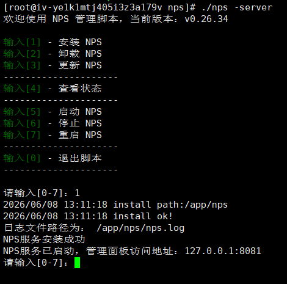
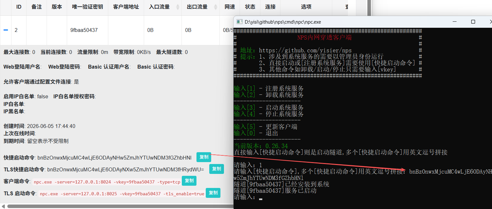
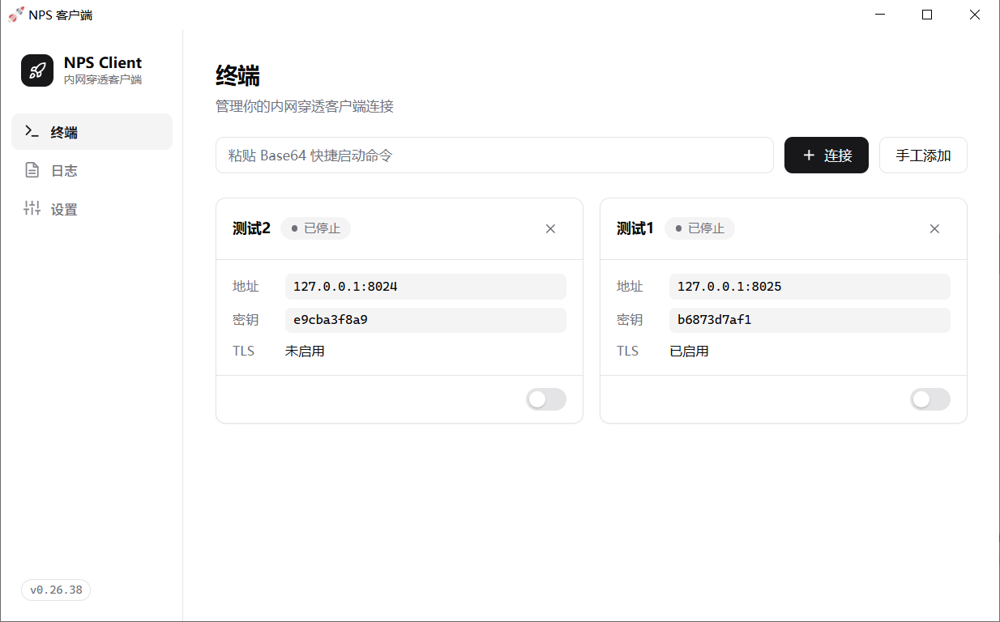

# NPS 内网穿透


> 一款轻量级、高性能、功能强大的内网穿透代理服务器。

---

## 🚀 快速开始

### 下载

从 [releases](https://github.com/lima-droid/nps/releases) 下载对应平台版本。服务端 `nps` 和客户端 `npc` 是独立的压缩包。

### 服务端

```shell
./nps -server    # 交互菜单：安装/卸载/启动/停止/更新
```

首次启动自动生成 `conf/nps.conf`，随机生成 `web_password`、`auth_key`、`auth_crypt_key`，请从启动日志或 `nps.conf` 获取。



### 客户端

```shell
./npc            # 直接双击运行，按提示输入即可
```

在 Web 后台复制【快捷启动命令】，客户端粘贴即可注册系统服务、启停或卸载。



#### GUI



#### 命令行直接启动

```shell
npc -server=ip:8024 -vkey=xxx                           # 标准
npc -server=ip:8025 -vkey=xxx -tls_enable=true           # TLS 桥接
npc -server=ip:8024 -vkey=vkey1,vkey2                    # 多隧道
```

---

## 📃 License

GPL-3.0 License