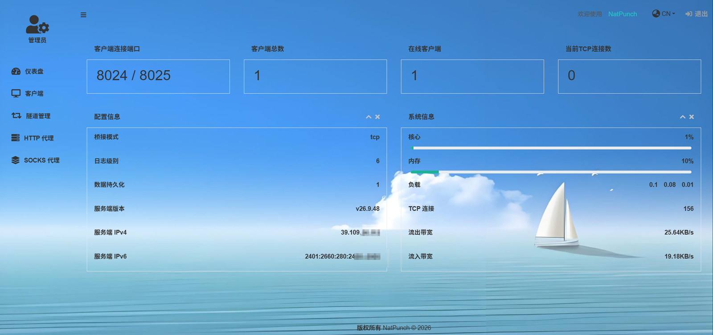

# NatPunch

> 轻量级内网穿透 / 无公网设备管理平台。可选 TLS 桥接加密（支持证书指纹固定），TCP/UDP 隧道 + HTTP/SOCKS5 代理，自动化运维管理软路由与服务器。
>
> **NatPunch 是基于 [ehang-io/nps](https://github.com/ehang-io/nps)（GPLv3）的修改版**，与原版的差异见 [NOTICE](NOTICE)。

## 特性

- **可选 TLS 桥接加密**：隧道流量可启用 TLS 传输，并支持证书指纹固定（`tls_fingerprint`）防中间人；默认 TCP 明文，按需开启
- **TCP / UDP 隧道**：SSH、远程桌面、任意端口，公网直达内网设备
- **HTTP / SOCKS5 代理**：支持账号密码，安全出网
- **自动化运维管理**：实时展示在线状态、隧道数、流量与带宽统计
- **面板 SSH 终端**：客户端列表一键进入（仅限本人/授权客户端，操作留审计日志），内置快捷命令
- **一键部署**：OpenWrt / Linux 一键安装，注册为系统服务运行
- **一键更新 / 卸载**：`update` 保留配置更新到最新版，卸载彻底清理
- **自动获取最新版**：安装/更新走 `releases/latest/download`，无需指定版本号
- **命名隔离**：客户端 `natpunch-client` 与服务端 `natpunch` 完全隔离，同机部署互不影响

## 可接受使用政策（AUP）

NatPunch 面向**合法运维场景**：仅允许用于部署方拥有或经明确授权的设备与网络（自建机房、家庭网络、公司内网运维等）。禁止用于：

- 未经授权访问、控制或穿透他人的设备、服务器与内网；
- 利用「面板 SSH 终端」「免凭据连接」特性获取他人系统的 shell；
- 任何违反当地法律或平台服务条款的用途。

部署方对使用行为与数据合规承担全部责任。终端会话会记录审计日志（操作人、时间、目标客户端）。

## 界面展示

Web 管理面板，实时查看设备状态、隧道、流量与系统资源：



## 部署

### 服务端

SSH 粘贴执行，进入管理菜单后**输入 `1` 安装**，按提示设置端口与账号密码，安装完成后自动启动：

```shell
sh -c "$(wget -qO- https://raw.githubusercontent.com/NekoBoxHQ/NatPunch/master/install_server.sh)"
```

> 该脚本是交互式管理菜单（`1` 安装 / `5` 状态 / `6` 修改面板连接配置 / `8` 卸载等），并非执行即自动安装。服务端与客户端命名隔离（`natpunch` / `natpunch-client`），同机部署互不影响。

### 客户端

登录 Web 面板，在【客户端】页添加客户端，复制 VKEY，在待部署设备上 SSH 粘贴执行面板生成的一键安装命令（OpenWrt 用 `uclient-fetch`，Linux 用 `wget`）。

> 客户端命名为 **`natpunch-client`**（二进制 `/usr/bin/natpunch-client`、自启 `natpunch-client`），与服务端 **`natpunch`** 在进程名、自启名上完全隔离——同机部署服务端时，客户端的安装/卸载/更新均不会影响服务端运行。
>
> 安装与更新**自动获取最新发布**（`releases/latest/download`），无需指定版本号。

### 卸载 / 更新客户端

`uninstall_client.sh` 同时支持卸载与更新（更新保留 `/etc/natpunch.conf` 配置，仅替换二进制并重启）。

> **升级断连安全**：SSH 通过客户端隧道连接时，升级会先下载并校验升级文件，再将替换/重启流程转入后台独立执行（日志 `/tmp/natpunch_update.log`），断开 SSH 不影响升级，完成后客户端自动重启、隧道恢复即可重新连接。通过面板 SSH 终端执行升级同样安全。

**卸载（Linux）**

```shell
wget -qO- https://raw.githubusercontent.com/NekoBoxHQ/NatPunch/master/uninstall_client.sh | sh
```

**更新（Linux）**

```shell
wget -qO- https://raw.githubusercontent.com/NekoBoxHQ/NatPunch/master/uninstall_client.sh | sh -s update
```

**卸载（OpenWrt）**

```shell
uclient-fetch -qO- https://raw.githubusercontent.com/NekoBoxHQ/NatPunch/master/uninstall_client.sh | sh
```

**更新（OpenWrt）**

```shell
uclient-fetch -qO- https://raw.githubusercontent.com/NekoBoxHQ/NatPunch/master/uninstall_client.sh | sh -s update
```

## License

GPL-3.0 License

NatPunch 是 [ehang-io/nps](https://github.com/ehang-io/nps)（GPLv3）的修改版。版权与修改范围见 [LICENSE](LICENSE) 与 [NOTICE](NOTICE)。

## 讨论群组 / Discussion Group

加入 Telegram 群组交流反馈: [NatPunch 讨论群](https://t.me/+Kdxyw8yLTz85ODg5)
